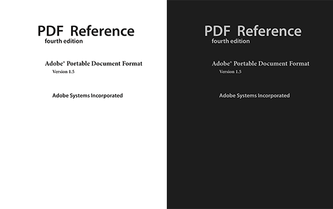
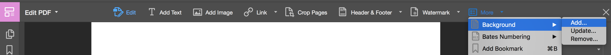

An Adobe Acrobat DC plug-in on macOS to change the colors of text and path objects in PDF documents to given colors.

Author: liuzikai  
Date: 02/25/2018

Revised based on Adobe Arcobat DC SDK project BasicPlugin.

Develop and Test Environment:
* **macOS 10.13.3**
* **Adobe Acrobat Pro DC** Version 2018.009.20050
* Xcode Version 9.2

In PDF file, lines and some shapes are path objects.

This plug-in can be used if you want to quickly change the colors of text and path objects in PDF files. For example, here you have a PDF file with black text and white background, and you want to inverse its colors to make it better to read, then you can change all its texts and paths into white color and add dark background to it. These changes are made on the PDF file instead of the reader, so the modified PDF can be also viewed on other readers.



However, some manual modifications may be also needed. Sometimes a seeming line is actually an image in PDF files, which will be ignored by this tool.


Install
---
**For macOS, Adobe Acrobat DC**

Copy **RecolorTool.acroplugin** to `/Users/(username)/Library/Application Support/Adobe/Acrobat/DC/Plug-ins`.


Usage
---
### 1. Prepare color settings
Color settings are written in a JSON file:
* TextColor
    * FillColor
    * StrokeColor
* PathColor
    * FillColor
    * StrokeColor

Colors use RGB representations, each color consists of three float numbers, corresponging to Red, Green, Blue. 1.0 means 100% (255, xFF), 0.0 means 0% (0, x00).

For example:

```json
{
  "path": {
    "stroke": [
      1.0,
      1.0,
      1.0
    ],
    "fill": [
      0.75,
      0.75,
      0.75
    ]
  },
  "text": {
    "stroke": [
      0.75,
      0.75,
      0.75
    ],
    "fill": [
      0.75,
      0.75,
      0.75
    ]
  }
}
```

Here the stroke color of path objects is set to white, while the others are light grey.

### 2. Open the PDF file to recolor in Acrobat.
### 3. Start the plug-in.
Menubar - Plug-In Tool - Recolor All Pages... or Recolor Current Pages...
### 4. Select the JSON file.
After the modifies are made, you can also change the background color using Acrobat build-in edit tool. Some manual modifications may be needed.



### 5. Save the PDF file.

For Developers
---
This plug-in is developed on macOS and for Acrobat DC. It seems that it can't be directly applied to Win or other version of Acrobat. If you are interested in it, it would be great if you can help developing other versions. :)

Some tips from my own development process:
1. Adobe Acrobat DC SDK for Mac is developed based on old Xcode and macOS, so some revisions are needed.
2. For Acrobat DC, it seems that plug-ins won't be valid if directly put in the application package.
3. The file MacCopyToPlugins.sh is a script provided by SDK that runs after building. It can perform work such as copying the plug-in to the corresponding folder. In current project, please change the `ACROBAT_PLUGINS_FOLDER` in **Environment.xcconfig** to your own path.


Reference
---
[Adobe Acrobat DC SDK for Mac](https://www.adobe.com/devnet/acrobat.html)

[Acrobat DC SDK Documentation](https://help.adobe.com/en_US/acrobat/acrobat_dc_sdk/2015/HTMLHelp/#t=Acro12_MasterBook%2FIntroduction_Help_TitlePage%2FAbout_This_Help.htm)

[Acrobat and PDF Library API Reference](https://help.adobe.com/en_US/acrobat/acrobat_dc_sdk/2015/HTMLHelp/Acro12_MasterBook/API_References_SectionPage/API_References/Acrobat_API_Reference/index.html)
